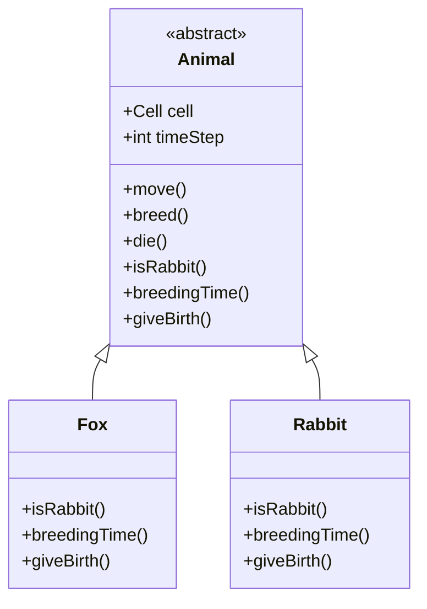
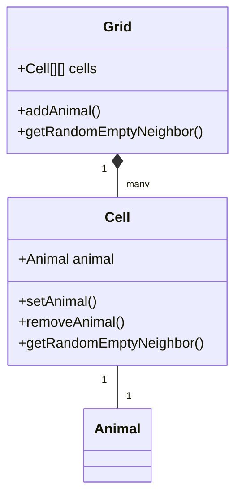
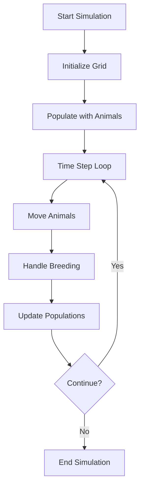
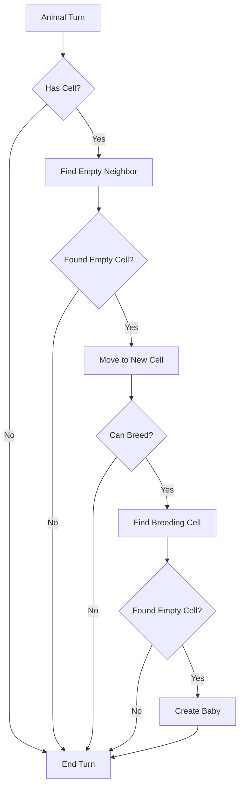

# Animal Population Simulator

A Java-based simulation of a predator-prey ecosystem featuring foxes and rabbits. The simulation models the interactions between these animals in a grid-based environment, including movement, breeding, and population dynamics.

## Project Structure

```
├── Animal.java           # Abstract base class for all animals
├── Fox.java             # Fox implementation (predator)
├── Rabbit.java          # Rabbit implementation (prey)
├── Grid.java            # Grid management and cell organization
├── Cell.java            # Individual cell in the grid
├── AnimalSimulator.java # Main simulation logic
├── Simulation.java      # Simulation runner
└── SimulationTest.java  # Test cases
```

## Setup and Running

1. Ensure you have Java JDK installed on your system
2. Compile all Java files:
   ```bash
   javac *.java
   ```
3. Run the simulation:
   ```bash
   java Simulation
   ```

## System Architecture

### Class Hierarchy


### Grid Structure


## Simulation Logic

### Main Simulation Flow


### Animal Movement and Breeding


## Key Features

1. **Grid-Based Environment**
   - Animals move between cells in a grid
   - Each cell can hold one animal
   - Animals can only move to empty neighboring cells

2. **Animal Behavior**
   - **Foxes (Predators)**
     - Move randomly
     - Breed at specific time intervals
     - Represented as predators in the ecosystem
   
   - **Rabbits (Prey)**
     - Move randomly
     - Breed more frequently than foxes
     - Represented as prey in the ecosystem

3. **Population Management**
   - Tracks population of both species
   - Handles animal movement and breeding
   - Maintains ecosystem balance

## Simulation Rules

1. Each time step:
   - Animals move to random empty neighboring cells
   - Animals may breed if conditions are met
   - Population counts are updated

2. Movement Rules:
   - Animals can only move to empty cells
   - Movement is random but restricted to neighboring cells
   - Animals cannot share cells

3. Breeding Rules:
   - Animals breed at specific time intervals
   - New animals are placed in empty neighboring cells
   - Breeding success depends on available space

## Author

John Morfidis 