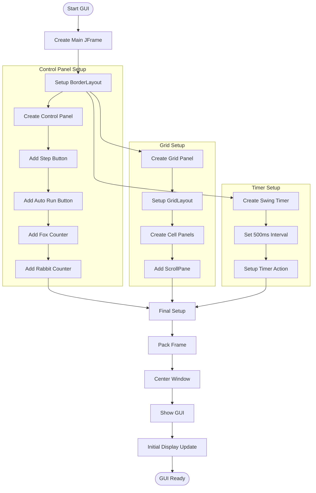
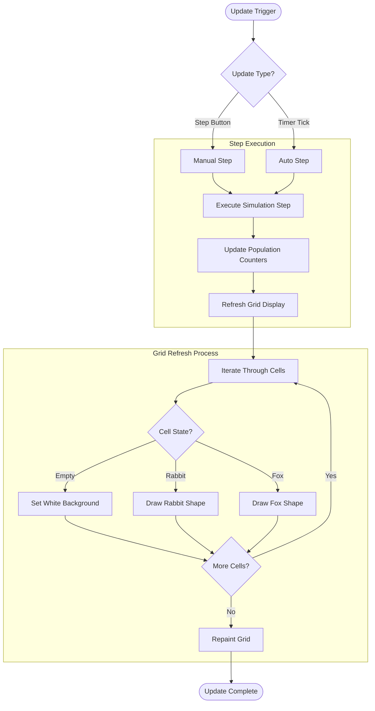
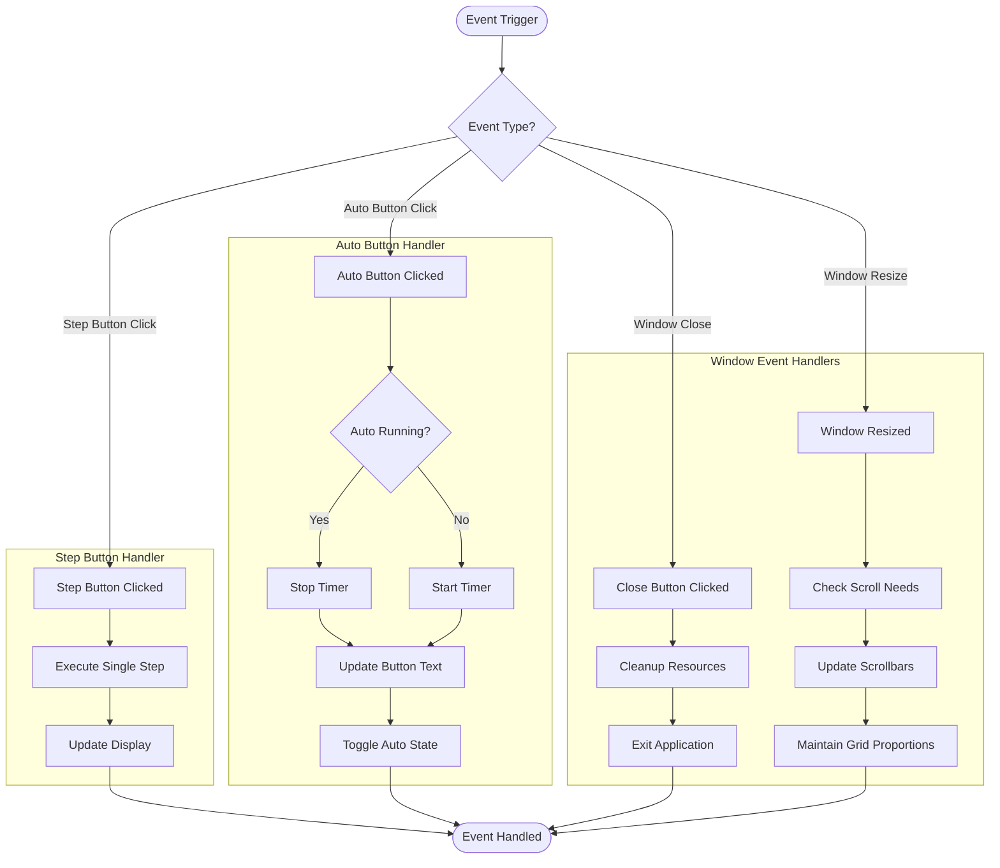
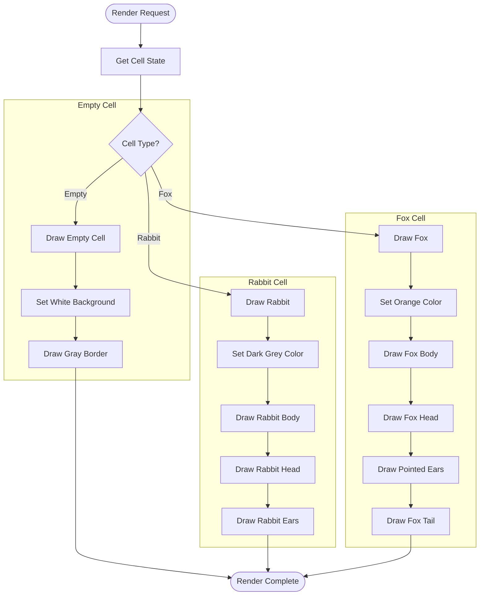
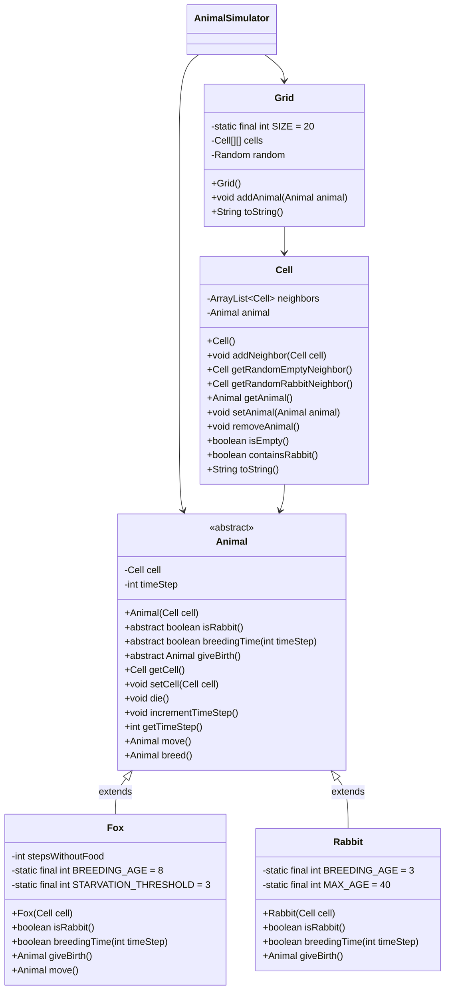
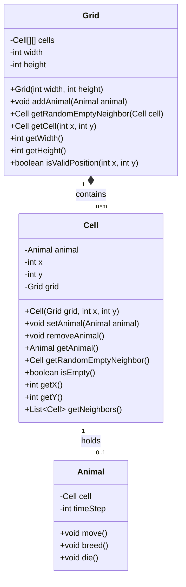
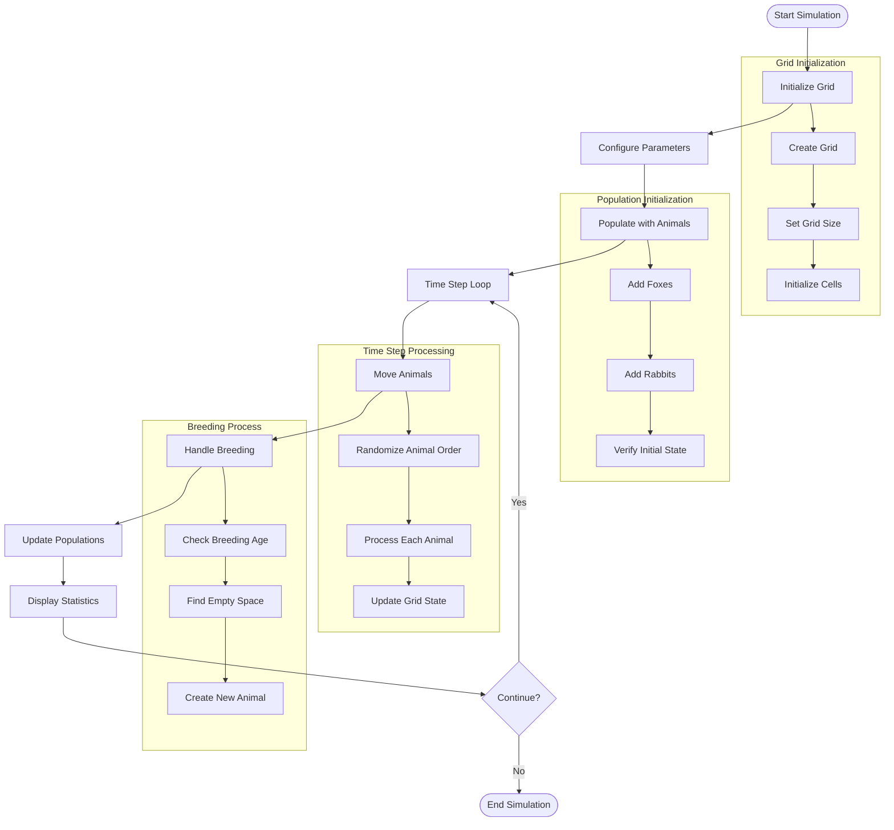
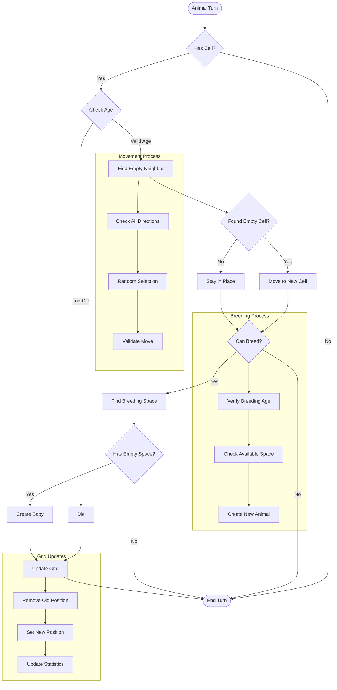

# Animal Population Simulator

A Java-based simulation of a predator-prey ecosystem featuring foxes and rabbits. The simulation models the interactions between these animals in a grid-based environment, including movement, breeding, and population dynamics.

## Project Structure

```
├── Animal.java           # Abstract base class for all animals
├── Fox.java             # Fox implementation (predator)
├── Rabbit.java          # Rabbit implementation (prey)
├── Grid.java            # Grid management and cell organization
├── Cell.java            # Individual cell in the grid
├── AnimalSimulator.java # Main simulation logic
├── Simulation.java      # Simulation runner
└── SimulationGUI.java   # Graphical user interface
```

## Setup and Running

1. Ensure you have Java JDK installed on your system
2. Compile all Java files:
   ```bash
   javac *.java
   ```
3. Run the simulation:
   - For console mode:
     ```bash
     java Simulation
     ```
   - For GUI mode:
     ```bash
     java Simulation --gui
     ```

### GUI Features
- Visual representation of the grid with animal shapes:
  - Empty cells are shown in white with gray borders
  - Rabbits are shown as dark grey animal shapes
  - Foxes are shown as orange animal shapes
- Real-time population statistics display
- Interactive controls:
  - Step button: Advance simulation one step at a time
  - Auto Run button: Run simulation automatically
  - Population counters for foxes and rabbits
- Scrollable grid view for larger simulations
- Smooth animation with anti-aliased graphics

### GUI Technical Details

#### GUI Flowcharts

##### 1. Initialization and Setup Flow


##### 2. Update Process Flow


##### 3. Event Handling Flow


##### 4. Rendering Flow


## Detailed System Architecture

### Complete Class Hierarchy


### Detailed Grid Structure and Relationships


## Detailed Simulation Logic

### Complete Simulation Flow


### Detailed Animal Behavior Flow


## Detailed System Components

### 1. Grid-Based Environment
- **Grid Structure**
  - Two-dimensional array of cells
  - Each cell can hold exactly one animal
  - Grid maintains boundaries and valid positions
  - Cells track their position and neighbors

- **Cell Management**
  - Cells maintain references to their grid
  - Each cell knows its x,y coordinates
  - Cells can identify empty neighboring cells
  - Cells handle animal placement and removal

### 2. Animal Behavior System
- **Fox Behavior (Predator)**
  - Breeding age: 8 time steps
  - Starvation threshold: 3 steps without food
  - Movement: Prioritizes moving to cells with rabbits
  - If no rabbit nearby: Moves randomly to empty cell
  - Dies if no food for 3 consecutive steps
  - Breeding: Creates new fox in empty neighbor cell

- **Rabbit Behavior (Prey)**
  - Breeding age: 3 time steps
  - Movement: Random to empty neighboring cells
  - Breeding: Creates new rabbit in empty neighbor cell
  - No maximum age limit (removed incorrect MAX_AGE reference)

### 3. Population Management
- **Tracking System**
  - Maintains separate counts for foxes and rabbits
  - Updates counts after each time step
  - Handles animal creation and removal
  - Provides population statistics

- **Simulation Control**
  - Manages time step progression
  - Controls animal movement order
  - Handles breeding conditions
  - Updates grid state

### 4. Grid System
- **Grid Structure**
  - Fixed size: 20x20 cells
  - Cells maintain neighbor relationships
  - Grid is bounded (not toroidal)
  - Random placement of new animals
  - Visual representation:
    - "_" for empty cells
    - "o" for rabbits
    - "X" for foxes

### 5. Cell Management
- **Cell Properties**
  - Maintains list of neighboring cells
  - Can hold one animal or be empty
  - Provides methods for:
    - Finding empty neighbors
    - Finding rabbit neighbors (for foxes)
    - Animal placement and removal
  - Bidirectional neighbor relationships

## Simulation Rules and Parameters

### 1. Time Step Operations
- **Movement Phase**
  - Foxes move first, prioritizing rabbit neighbors
  - If no rabbit nearby, foxes move randomly
  - Rabbits move randomly to empty neighbors
  - Movement is restricted to grid boundaries
  - Animals cannot share cells

- **Breeding Phase**
  - Foxes breed every 8 time steps
  - Rabbits breed every 3 time steps
  - Breeding requires empty neighboring cell
  - New animals inherit parent's type
  - Breeding resets parent's breeding timer

### 2. Environmental Rules
- **Grid Constraints**
  - Fixed 20x20 grid size
  - Bounded grid (not toroidal)
  - Cells maintain neighbor relationships
  - Grid enforces movement boundaries

- **Population Limits**
  - Foxes die after 3 steps without food
  - Breeding limited by available space
  - Population density affects breeding success
  - Grid size (400 cells) limits total population

### 3. Statistical Tracking
- **Population Metrics**
  - Current fox and rabbit counts
  - Breeding success rates
  - Population growth trends
  - Survival rates by species

## Author

John Morfidis 